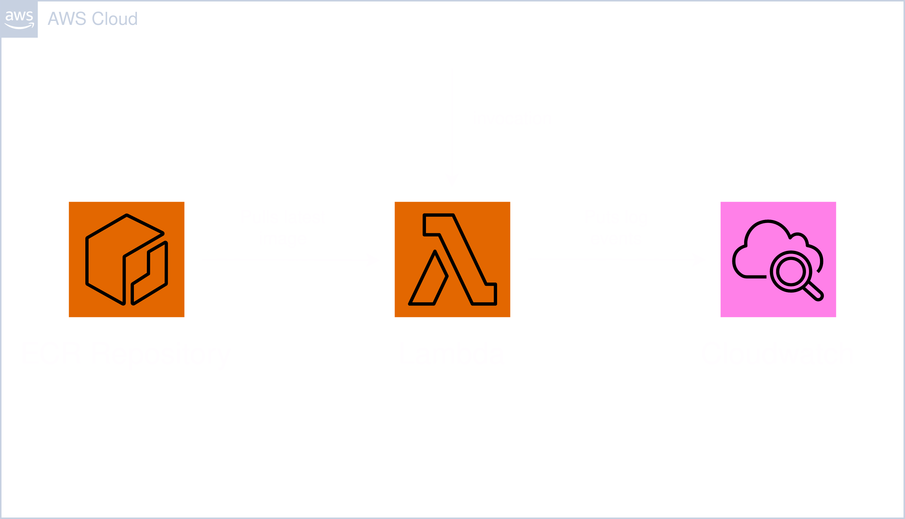

# Module: Function



This module provides a Lambda function which logs to CloudWatch. If no image URI is provided it will also create an ECR repository for one to upload.

## Contents

- [Requirements](#requirements)
- [Inputs](#inputs)
- [Outputs](#outputs)
- [Example](#example)
- [Contributing](#contributing)

## Requirements

| Name      | Version |
| --------- | ------- |
| terraform | >= 1.0  |
| aws       | >= 5.20 |

## Inputs

| Name          | Description                                                                                           | Type           | Default | Required |
| ------------- | ----------------------------------------------------------------------------------------------------- | -------------- | ------- | :------: |
| identifier    | Unique identifier to differentiate global resources.                                                  | `string`       | n/a     |   yes    |
| name          | Name of this module, which is used as identifier on all resources.                                    | `string`       | ""      |    no    |
| policies      | List of IAM policy ARNs for the Lambda's IAM role.                                                    | `list(string)` | []      |    no    |
| vpc_config    | Object to define the subnets and security groups for the Lambda function.                             | `object`       | null    |    no    |
| log           | A flag for make the Lambda function submit logs to CloudWatch.                                        | `bool`         | false   |    no    |
| image_uri     | URI of the image which will be pulled by the Lambda function to execute.                              | `string`       | ""      |    no    |
| memory_size   | Amount of memory in MB the Lambda function can use at runtime.                                        | `number`       | 128     |    no    |
| timeout       | Amount of time the Lambda function has to run in seconds.                                             | `number`       | 3       |    no    |
| env_variables | A map of environment variables for the Lambda function at runtime.                                    | `map(string)`  | {}      |    no    |
| tags          | A map of tags to add to all resources. Name is always set as tag and the other tags will be appended. | `map(string)`  | {}      |    no    |

### `vpc_config`

| Name            | Description                                                  | Type           | Default | Required |
| --------------- | ------------------------------------------------------------ | -------------- | ------- | :------: |
| subnets         | List of subnet IDs in which the Lambda function will run in. | `list(string)` | n/a     |   yes    |
| security_groups | List of security group IDs the Lambda function will hold.    | `list(string)` | n/a     |   yes    |

## Outputs

| Name | Description                     |
| ---- | ------------------------------- |
| arn  | The ARN of the Lambda function. |

## Example

```hcl
module "function" {
  source = "github.com/custom-terraform-aws-modules/function"

  identifier = "example-function-dev"
  name       = "example-function"
  policies = [
    "arn:aws:iam::aws:policy/aws-service-role/AccessAnalyzerServiceRolePolicy",
    "arn:aws:iam::aws:policy/AdministratorAccess-Amplify"
  ]
  log         = true
  image_uri   = "test.registry:latest"
  memory_size = 128
  timeout     = 3
  env_variables = {
    TEST_VAR = 3
  }

  vpc_config = {
    subnets         = ["subnet-938y92g2", "subnet-a98yewgwe"]
    security_groups = ["sg-woht9328g23", "sg-3429yfwlefhwe"]
  }

  tags = {
    Project     = "example-project"
    Environment = "dev"
  }
}
```

## Contributing

In order for a seamless CI workflow copy the `pre-commit` git hook from `.github/hooks` into your local `.git/hooks`. The hook formats the terraform code automatically before each commit.

```bash
cp ./.github/hooks/pre-commit ./.git/hooks/pre-commit
```
